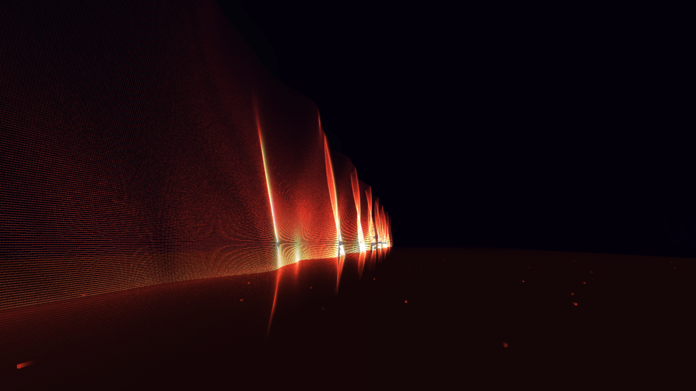

# The Black Wall



An atmospheric, energy-efficient 3D screensaver inspired by the Blackwall of
Cyberpunk 2077: an endless wall of glowing pixels standing on a dark floor in
empty space. The wall stretches to infinity left and right and fades away
upward. It breathes with your machine: CPU load tightens its wave, network
traffic pushes spikes through it.

**Status.** Windows: 1.0, stable. Linux (XScreenSaver): new. It builds on
Ubuntu 22.04 and 24.04 (x86-64 and Arm64), Debian, Fedora, Arch and openSUSE,
and renders and embeds in other programs' windows under Ubuntu; the
end-to-end test with a live XScreenSaver is still being brought up in CI.

## Run it

### Windows

Everything is portable and open source. Nothing is installed system-wide
except the screensaver itself, and Visual Studio is not needed.

1. **Get the build tools.** Downloads GCC, CMake, Ninja and the SDL3 source
   into `C:\workenv`, checking every archive against a pinned SHA-256. Run it
   once; running it again only verifies what is already there.

   ```bat
   1-downloads-tools.cmd
   ```

2. **Build the screensaver.** Produces `build\win-mingw\TheBlackWall.scr`,
   a single static executable with no runtime dependencies. Takes a couple of
   minutes the first time, because SDL3 is compiled from source.

   ```bat
   2-build-for-win64.cmd
   ```

3. **Install it.** Copies the `.scr` into `%LOCALAPPDATA%\TheBlackWall` and
   makes it the active screensaver for the current user.

   ```powershell
   powershell -ExecutionPolicy Bypass -File tools\install-windows.ps1
   ```

To look at it before installing, run `build\win-mingw\TheBlackWall.scr /w`
for a window or `/s` for fullscreen; `Esc` always exits.

To skip building, download `TheBlackWall.scr` from the
[releases page](https://github.com/ErickDoppler/Screensaver-TheBlackWall/releases).

### Linux

The screensaver runs as an [XScreenSaver](https://www.jwz.org/xscreensaver/)
hack, with its own page in `xscreensaver-settings`. The scripts handle apt,
dnf, pacman and zypper (Debian, Ubuntu, Fedora, Arch, openSUSE) on x86-64 and
Arm64.

1. **Get the build tools.** Installs a C compiler and the X11, Wayland and
   OpenGL development files with your package manager (it asks for your
   password), then downloads CMake, Ninja and the SDL3 source into
   `~/workenv`, checking every archive against a pinned SHA-256. Run it once;
   running it again only verifies what is already there.

   ```sh
   ./1-downloads-tools.sh
   ```

2. **Build the screensaver.** Produces `build/linux/theblackwall`, a single
   executable with SDL3 built in; at run time it needs only libc, libX11 and
   libGL, which every desktop has. Takes a couple of minutes the first time,
   because SDL3 is compiled from source.

   ```sh
   ./2-build-for-linux.sh
   ```

3. **Install it.** Copies the binary into XScreenSaver's hack directory and
   its settings page into XScreenSaver's config directory (it asks for your
   password), then puts The Black Wall at the top of your list in
   `~/.xscreensaver` and makes it the one XScreenSaver shows. The previous
   `~/.xscreensaver` is kept as `~/.xscreensaver.bak-theblackwall`.

   ```sh
   ./tools/install-linux.sh
   ```

   If XScreenSaver is not installed or not running, the script says how to
   get it going (for example `sudo apt install xscreensaver xscreensaver-gl`,
   then `xscreensaver --no-splash &`). The timeout and options are then in
   `xscreensaver-settings`.

To look at it before installing, run `build/linux/theblackwall --window` for
a window or `-s` for fullscreen; `Esc` always exits.

XScreenSaver only blanks X11 sessions, and GNOME and KDE run their own screen
lockers instead of it unless you turn those off. On Wayland, or without
XScreenSaver, the binary still runs fullscreen with `-s`.

## Build options (Windows)

The numbered scripts above are all a normal build needs; this section is for
anything other than a plain Release build.

`2-build-for-win64.cmd` takes `debug` (symbols, into
`build\win-mingw-debug`) and `clean` (discard the build folder first). Set
`BW_WORKENV` if the toolchain lives somewhere other than `C:\workenv`.

By hand, with the toolchain on PATH:

```bat
call tools\env.cmd
cmake --preset win-mingw
cmake --build --preset win-mingw
```

`tools\build-windows.cmd` does those three lines in one step. Note that
`tools\env.cmd` puts w64devkit first on PATH, so it uses the CMake bundled
inside w64devkit rather than the pinned one in `C:\workenv`;
`2-build-for-win64.cmd` prefers the pinned copy.

Output either way: `build\win-mingw\TheBlackWall.scr`, a single static
executable. See [docs/TOOLING.md](docs/TOOLING.md) for what is in the
toolchain and why.

Besides the installer script, you can right-click the `.scr` in Explorer and
choose **Install**.

## Build and install options (Linux)

`1-downloads-tools.sh [dir] [--force] [--no-packages]`: installs the
toolchain into `dir` instead of `~/workenv` (or set `BW_WORKENV`); `--force`
unpacks again; `--no-packages` skips the package manager when you already have
a compiler, `pkg-config`, `curl`, `unzip` and the X11 and OpenGL development
files.

`2-build-for-linux.sh [debug] [clean]`: `debug` builds with symbols into
`build/linux-debug`, `clean` discards the build folder first. It uses the
pinned CMake and Ninja from the workenv when they are there, and the system's
otherwise (CMake 3.25 or newer).

`tools/install-linux.sh` options:

| Option          | Effect |
|-----------------|--------|
| `--user`        | No sudo: installs into `~/.local/libexec/theblackwall`. XScreenSaver runs it, but the settings page needs the system-wide install, so options come from `settings.conf` (see [Settings](#settings)). |
| `--no-activate` | Adds it to the list without making it the only screensaver; the current selection stays on the same one. |
| `--uninstall`   | Removes the files and the entry in `~/.xscreensaver`. |

By hand:

```sh
cmake --preset linux -DFETCHCONTENT_SOURCE_DIR_SDL3=$HOME/workenv/SDL3-3.4.16
cmake --build --preset linux
```

Without `FETCHCONTENT_SOURCE_DIR_SDL3`, CMake downloads the same pinned SDL3
itself. The `linux-system-sdl` preset links an SDL3 already installed on the
system instead. For packaging, `cmake --install build/linux --prefix /usr`
installs the binary into `libexec/xscreensaver` and the settings page into
`share/xscreensaver/config`; set `BW_XSS_HACKDIR` for distributions that keep
hacks elsewhere (Arch: `lib/xscreensaver`).

## Windows Defender

An unsigned, freshly built `.scr` can trip Defender's machine-learning
heuristics (typically reported as `Trojan:Win32/Wacatac.*!ml`). The binary is
stripped, statically linked, carries version info, a manifest and DEP/ASLR
flags, and never launches other programs, which keeps it clean in on-demand
scans; behavioural detections on first run are still possible. If it
happens:

1. Report it as a false positive at
   <https://www.microsoft.com/wdsi/filesubmission> (choose "Software
   developer"), attaching `TheBlackWall.scr`. Microsoft usually clears it
   within a day or two, and the fix reaches everyone through the definition
   updates.
2. Meanwhile, restore the file from Defender's protection history and add
   an exclusion for the install folder (`%LOCALAPPDATA%\TheBlackWall`).
3. Code-signing the `.scr` with a certificate from a public CA removes the
   problem at the root, since reputation attaches to the signer.

## Command line

Windows calls the screensaver with the standard switches:

| Switch      | Meaning                                              |
|-------------|------------------------------------------------------|
| `/s`        | run fullscreen across all monitors                   |
| `/p <hwnd>` | live preview inside the Windows screensaver dialog   |
| `/c`        | settings dialog (also the default with no arguments) |

XScreenSaver calls it the way it calls its own hacks:

| Switch             | Meaning                                                   |
|--------------------|-----------------------------------------------------------|
| `--root`           | draw inside XScreenSaver's window (`$XSCREENSAVER_WINDOW`); fullscreen when that is not set |
| `--window-id <id>` | draw inside the given X11 window (the settings preview)   |
| `-s`               | run fullscreen                                            |

With no switch at all, the Linux build opens a window.

Developer switches (both platforms):

| Switch                          | Meaning                                          |
|---------------------------------|--------------------------------------------------|
| `/w` or `--window 1600x900`     | run in a resizable window                        |
| `--dump out.png --frames 90`    | render 90 frames, save the last one, exit        |
| `--cpu 0.8` / `--net 20000000`  | fake CPU load (0..1) / network bits per second   |
| `--log file.txt`                | append diagnostics to a file                     |
| `--pose`                        | the figure positioning tool, in a window         |
| `--model <n>`                   | the figure the pose tool starts with             |
| `--yaw 180`                     | start facing away from the wall                  |
| `--back 300`                    | start 300 m from the wall                        |
| `--figure-every <metres>`       | spacing of the figures (`-1` summons one at once) |
| `--<setting> <value>`           | override any setting for this run, e.g. `--density 80 --pixel-type matrix --wall-color #ff3b1f` |

At configure time, `-DBW_MODEL_POINTS=<n>` changes how many points are kept
per figure model (default 40000). `tools/make_icon.py` regenerates the icon.

### Settings

Setting keys: `side-movement`, `movement-speed`, `mouse-rotation`,
`exit-on-mouse-move`, `mouse-sensitivity`, `click-resets-view`,
`exit-on-any-key`, `density`, `pixel-size` (the dot itself, from about
2 x 2 screen pixels up to a chunky LED), `blur`, `ghost-tail`, `shimmer`
(0 = smooth, 100 = pixels flicker as if tearing off), `pixel-type`
(square/round/matrix), `horizon` (distant city, default on), `show-ghosts`,
`fps` (10..120, default 60), `wall-color`, `floor-color`, `space-color`,
`horizon-color` (default blue).

On Windows, settings persist in `HKCU\Software\TheBlackWall` and are edited
in the settings dialog.

On Linux, XScreenSaver passes the options from its settings page on the
command line. Anything else is read from
`~/.config/theblackwall/settings.conf` (under `$XDG_CONFIG_HOME` if set), one
`key = value` per line: numbers in decimal (switches 0 or 1; `pixel-type` 0
square, 1 round, 2 matrix) and colors as `#RRGGBB`, for example:

```ini
density = 80
wall-color = #ff3b1f
```

## Controls

In a window, and fullscreen when **Exit on any button** is off, the mouse
looks around and the keyboard steers the camera. Inside XScreenSaver the
keyboard and mouse belong to XScreenSaver, which unblanks on any input.

| Key                   | Action                                       |
|-----------------------|----------------------------------------------|
| Up/Down or W/S, wheel | move forward / back along the view direction |
| Left/Right or A/D     | strafe left / right relative to the view     |
| Shift + movement      | three times faster                           |
| Ctrl                  | crouch, at half speed (overrides Shift)      |
| Space                 | jump, half a metre up                        |
| PageUp/PageDown, Q/E  | standing height                              |
| J/L, I/K              | yaw, pitch                                   |
| T                     | toggle side movement                         |
| Home or R             | reset the view                               |
| Esc                   | exit (always)                                |

Touch any control and the screensaver lets go: the automatic drift along the
wall stops and the view stays where you put it. Both come back after 20
seconds of no input.

Jumping again the instant you land, while moving, chains. From the third
jump in a row you travel twice as fast and the hop grows: half a metre and
0.64 s in the air become a full metre and 1.15 s by the fifth. With Shift
that is six times normal speed. Stop jumping for half a second and the chain
is gone.

With **Mouse controlled rotation** on, moving the mouse looks around and a
click exits.

## Layout

```
src/            portable C11 core (SDL3 + OpenGL 3.3); platform_win32.c and
                platform_linux.c hold what differs per OS
src/shaders/    GLSL, embedded into the binary at build time
res/win32/      dialog, manifest, version info
res/linux/      XScreenSaver settings page
res/models/     figure models, turned into point tables at build time
cmake/          toolchain file + shader embedding script
tools/          env / build / install helpers, model converter
docs/           design and tooling notes, screenshots
third_party/    stb_image_write.h (public domain), cgltf.h (MIT)
.github/        Linux CI: build on Ubuntu and other distributions, then run
                it headless and inside a live XScreenSaver
```

See [docs/DESIGN.md](docs/DESIGN.md) for how the wall is simulated and drawn.

## License

MIT. Dependencies: SDL3 (zlib), stb (public domain / MIT), cgltf (MIT, used
only at build time); on Linux also libX11 (MIT).
